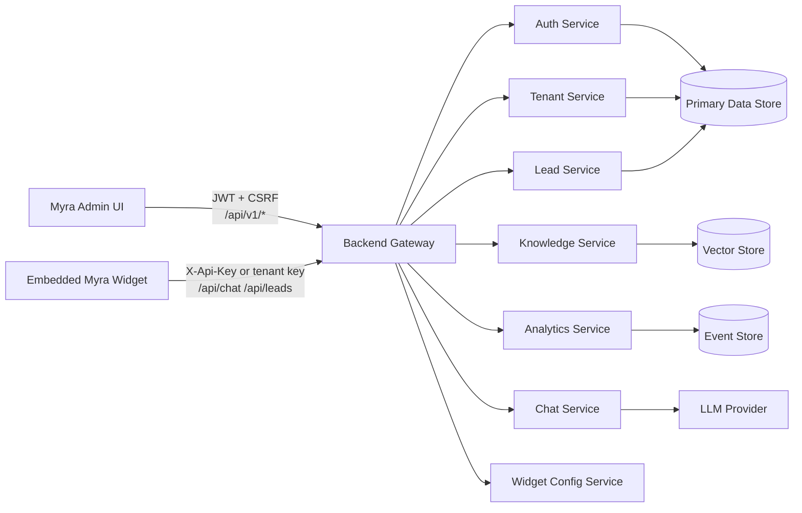

# Myra Backend Architecture

## Decision

The expected production backend uses a gateway pattern. The frontend should treat the gateway as the stable public API boundary and should not call internal services directly in staging or production.

Direct service access is supported for local development through optional `VITE_*_API_URL` overrides. If those variables are not set, every API client uses `VITE_API_BASE_URL`.

## Gateway Routes

The gateway must route both admin and public widget endpoints:

- `/api/v1/auth/*` -> auth service
- `/api/v1/tenants/*` -> tenant service
- `/api/v1/knowledge/*` -> knowledge service
- `/api/v1/analytics/*` -> analytics service
- `/api/v1/leads/*` -> lead service for admin views
- `/api/v1/widget/*` -> widget configuration service
- `/api/chat` -> chat service for embedded widget conversations
- `/api/leads` -> lead service for embedded widget lead capture

## Service Diagram

## Authentication Model

Admin routes use JWT access tokens and should also support secure httpOnly refresh cookies from the gateway. Widget routes should support API key authentication for compatibility with public embeds:

- Admin: `Authorization: Bearer <jwt>`, `X-CSRF-Token` for state-changing requests.
- Widget: `X-Api-Key: <public-widget-key>` or a gateway-issued tenant widget key.
- Refresh: `POST /api/v1/auth/refresh` returns a fresh access token when the refresh cookie is valid.

The frontend sends credentials with API requests and attaches CSRF tokens from the `MYRA_CSRF_TOKEN` cookie when available. The backend remains responsible for issuing httpOnly cookies, enforcing CSRF validation, and applying server-side rate limits.

## Resilience

`src/lib/apiClient.ts` centralizes:

- configurable request timeout via `VITE_API_TIMEOUT_MS`
- retry with exponential backoff for network, rate-limit, and 5xx failures
- typed error classification for network, timeout, validation, auth, rate-limit, and server errors
- client-side request throttling as a defensive UI layer
- structured request/response logging

Server-side rate limiting, audit storage, and production error ingestion should be implemented at the gateway or service layer.
